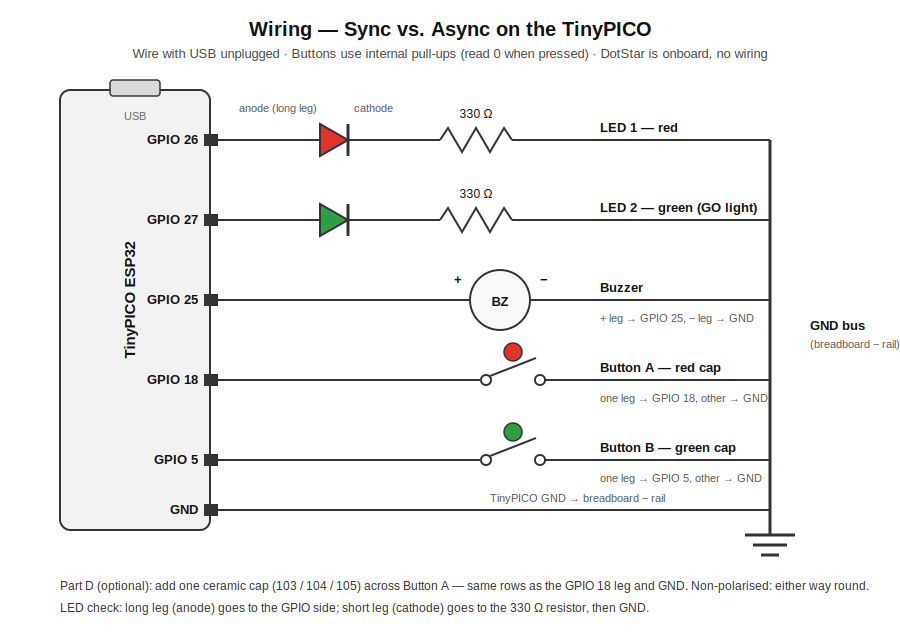

# Warm-up: Wiring & Setup

⏱️ **30 min**

[← Overview](00-overview.md) · [Home](../README.md) · **Next:** [Part A — Synchronous →](02-part-a-synchronous.md)

---

## 1. Pin map

> [!IMPORTANT]
> Verify these against your TinyPICO's usable-GPIO map before class — a couple of ESP32 pins are input-only or strapping pins. The choices below avoid known trouble pins.

| Component | TinyPICO GPIO | Wiring notes |
|---|---|---|
| LED 1 (red) | GPIO 26 | GPIO 26 → anode; cathode → 330 Ω → GND |
| LED 2 (green) | GPIO 27 | GPIO 27 → anode; cathode → 330 Ω → GND |
| Buzzer | GPIO 25 | + leg → GPIO 25; – leg → GND |
| Button A (red cap) | GPIO 18 | One leg → GPIO 18; opposite leg → GND |
| Button B (green cap) | GPIO 5 | One leg → GPIO 5; opposite leg → GND |
| DotStar | onboard | No wiring — built into the TinyPICO |

> [!NOTE]
> **Why pull-ups?** Buttons are wired to GND and use the ESP32's internal pull-up resistor (`Pin.PULL_UP`). The pin reads `1` when released and `0` when pressed. No external resistor needed.

### Wiring diagram



*Printable version: open [`diagrams/wiring.svg`](../diagrams/wiring.svg) directly and print it — one per bench is handy.*

## 2. Setup checklist

1. Connect the TinyPICO via USB and open Thonny.
2. In Thonny: **Tools → Options → Interpreter** → select "MicroPython (ESP32)" and the correct COM/serial port.
3. Confirm the REPL responds: type `print('hello')` at the `>>>` prompt.
4. Build the circuit on the breadboard following the pin map above, with power **off** (USB unplugged) while wiring.

> [!TIP]
> Thonny won't connect, no `>>>` prompt, or the board seems possessed? The [Troubleshooting & FAQ](../TROUBLESHOOTING.md) covers the common failures — starting with charge-only USB cables and the wrong COM port.

## 3. Wiring test — confirm every component

Run [`code/wiring_test.py`](../code/wiring_test.py) and follow the printed prompts. It checks the whole breadboard in order: LED 1 blinks, LED 2 blinks, the buzzer beeps twice, then it waits for you to press each button (and beeps to confirm each press). It ends with **"All wiring checks passed!"** — don't move on to Part A until you see it.

```python
from machine import Pin
import time

led1 = Pin(26, Pin.OUT)
led2 = Pin(27, Pin.OUT)
buzzer = Pin(25, Pin.OUT)
btnA = Pin(18, Pin.IN, Pin.PULL_UP)
btnB = Pin(5, Pin.IN, Pin.PULL_UP)

def blink(led, name):
    print("[TEST]", name, "-- watch it blink 3 times")
    for _ in range(3):
        led.on(); time.sleep(0.3)
        led.off(); time.sleep(0.3)

def wait_press(btn, name):
    if btn.value() == 0:
        print("[WARN]", name, "already reads PRESSED -- check its wiring")
    print("[TEST] Press", name, "now...")
    while btn.value() == 1:
        time.sleep(0.01)
    print("       ", name, "OK")
    buzzer.on(); time.sleep(0.1); buzzer.off()
    while btn.value() == 0:      # wait for release
        time.sleep(0.01)
    time.sleep(0.2)

blink(led1, "LED 1 (red, GPIO 26)")
blink(led2, "LED 2 (green, GPIO 27)")

print("[TEST] Buzzer -- listen for two beeps")
for _ in range(2):
    buzzer.on(); time.sleep(0.15)
    buzzer.off(); time.sleep(0.25)

wait_press(btnA, "Button A (red cap, GPIO 18)")
wait_press(btnB, "Button B (green cap, GPIO 5)")

print()
print("All wiring checks passed! Your breadboard is ready.")
```

> [!WARNING]
> **A step failed?** Fix that one component before moving on — the test names the exact pin. LEDs: check polarity (long leg = anode = GPIO side; short leg → resistor → GND) and that the resistor is in series. Buttons: if the test says a button already reads pressed, the pin is shorted to GND; if pressing does nothing, the button legs aren't bridging the pin to GND (use opposite corners). More help: [Troubleshooting & FAQ](../TROUBLESHOOTING.md).

> [!NOTE]
> Two things to notice, both of which matter later: the onboard **DotStar isn't tested here** — it needs a library you'll install in [Part C](04-part-c-dotstar.md). And this test is *synchronous* code — each step blocks until it finishes, which is fine for a step-by-step checklist. By the end of the session you'll know exactly when it stops being fine.

---

[← Overview](00-overview.md) · [Home](../README.md) · **Next:** [Part A — Synchronous →](02-part-a-synchronous.md)
